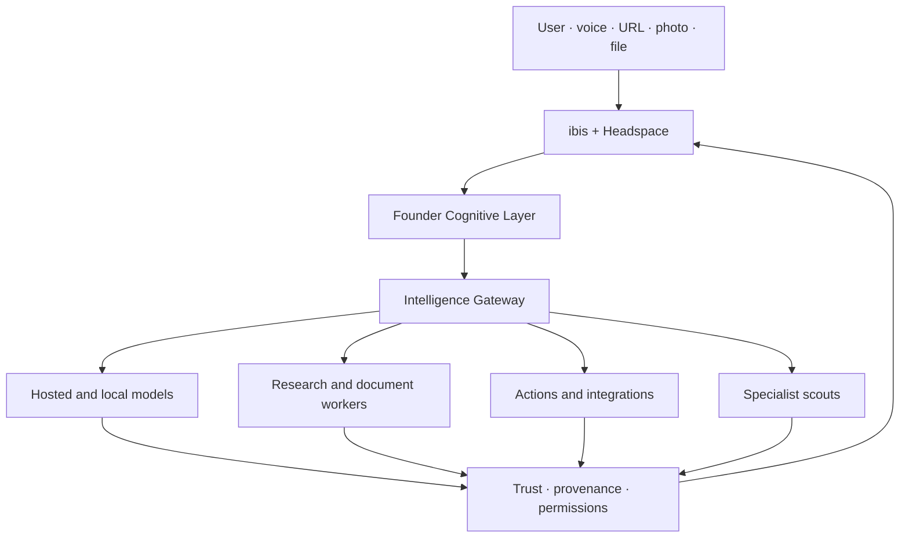
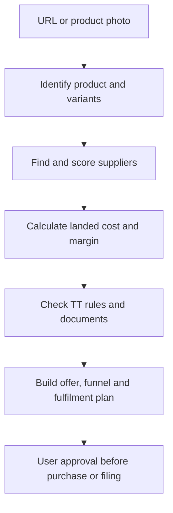

# ibis Open-Source Capability Architecture

Date: 2026-09-09  
Status: implementation decision record  
Scope: open-source infrastructure and models that can make ibis answer reliably and execute the full scout family without replacing ibis, Headspace, the Founder Cognitive Layer, or FTN's Caribbean data ownership.

## Executive decision

There is no credible, mature open-source project that safely performs every ibis scout job by itself. Installing a collection of all-in-one assistants would duplicate orchestration, create conflicting memory systems, increase the attack surface, and weaken the Founder Cognitive Layer.

The recommended system is a **composable ibis capability fabric**:

1. ibis remains the product, user interface, permission authority, provenance authority, and Caribbean intelligence layer.
2. The Founder Cognitive Layer participates in every request for every user. It is not a founder-only feature. It contributes the reusable reasoning method: clarify the real goal, consider second-order effects, find leverage, respect constraints, and choose the next sensible step.
3. An ibis Intelligence Gateway routes each task across hosted models, local/open-weight models, deterministic functions, retrieval, and specialist workers.
4. Activepieces supplies common integrations and workflow execution instead of FTN rebuilding hundreds of connectors.
5. LangGraph supplies resumable, stateful multi-step agent execution where the current orchestrator needs durable branching and human approval.
6. Specialist open-source workers provide document reading, crawling, browser action, commerce, music, voice, and visual-node capabilities.
7. Promptfoo continuously proves that simple questions, Caribbean questions, provider failover, safety boundaries, and specialist workflows still work.

This is the closest practical equivalent to “APIQIK plus the Founder and Caribbean model in the middle.” APIQIK is a model gateway. ibis must be a governed intelligence and execution system.

## The intended architecture

The Founder Cognitive Layer does not impersonate a person or expose private founder memories. It applies an explicit, testable cognitive method. Private founder information remains permissioned and separate from the general reasoning policy.

## Adoption shortlist

### Adopt first

| Component | Role inside ibis | Licence/status | Decision |
|---|---|---|---|
| [LiteLLM](https://github.com/BerriAI/litellm) | OpenAI-compatible gateway across hosted and local providers; fallbacks, budgets, keys and usage | MIT core; enterprise directory separate | Evaluate behind the existing Intelligence Gateway. Do not replace the ibis routing contract. |
| [Ollama](https://github.com/ollama/ollama) | Simple local model runtime and offline fallback | MIT; each model has its own licence | Add as a provider adapter, initially on an FTN-controlled worker or founder computer. |
| [llama.cpp](https://github.com/ggml-org/llama.cpp) | Efficient CPU/GPU inference and OpenAI-compatible local server | MIT; each model has its own licence | Use where lower-level control or constrained hardware matters. Ollama can remain the friendlier default. |
| [Activepieces](https://github.com/activepieces/activepieces) | Workflow engine and common app connectors; retries, branches, approvals and MCP exposure | MIT community core; commercial enterprise directories | Primary connector/execution bus. Keep ibis permissions in front of it. |
| [LangGraph JS](https://github.com/langchain-ai/langgraphjs) | Durable, stateful workflows with checkpoints and human-in-the-loop execution | MIT | Use for long-running scout plans and recoverable execution, not ordinary one-answer requests. |
| [Docling](https://github.com/docling-project/docling) | Parse PDF, DOCX, PPTX, XLSX, HTML, images, audio and video into structured content | MIT | First document-intelligence worker. Run locally or on a private worker where documents are sensitive. |
| [PaddleOCR](https://github.com/PaddlePaddle/PaddleOCR) | OCR and document structure across 100+ languages | Apache-2.0 | OCR fallback and specialist image/document extraction behind Docling. |
| [Crawl4AI](https://github.com/unclecode/crawl4ai) | LLM-friendly, self-hosted web crawling and extraction | Apache-2.0 | Main research crawler with domain rules, rate limits and source capture. |
| [Browser Use](https://github.com/browser-use/browser-use) | Controlled browser action for pages without suitable APIs | MIT library; hosted cloud is separate | Use only after explicit user approval for logins, forms, purchases, submissions and consequential actions. |
| [Promptfoo](https://github.com/promptfoo/promptfoo) | Model comparison, regression evaluation, red teaming and CI | MIT | Mandatory answer-continuity and Caribbean evaluation gate. |
| [GridStack](https://github.com/gridstack/gridstack.js) | Touch-aware responsive window grid, drag, resize and collision layout | MIT | Strongest candidate for Headspace snap/tile/tablet layout. Prototype without discarding current thought-surface behavior. |
| [React Flow / xyflow](https://github.com/xyflow/xyflow) | Node-and-edge interface for neurons, dependencies and executable workflows | MIT | Add neuron connections and process visualization in a later Headspace tranche. |

### Adopt as specialist workers

| Component | Scout capability | Licence/status | Boundary |
|---|---|---|---|
| [Medusa](https://github.com/medusajs/medusa) | Products, carts, orders, inventory and headless commerce | MIT core; enterprise modules separate | Use when ibis moves from planning funnels to running a material product catalogue. WAM remains the payment boundary. |
| [Mautic](https://github.com/mautic/mautic) | Self-hosted audience segmentation, campaigns and marketing automation | GPL-3.0 | Operate as an isolated service; do not copy GPL code into the ibis frontend. |
| [ERPNext](https://github.com/frappe/erpnext) | Purchasing, inventory, accounting and operations | GPL-3.0 | Later-stage operations system, not a near-term ibis dependency. Integrate by API if a user/company adopts it. |
| [Chatwoot](https://github.com/chatwoot/chatwoot) | Omnichannel customer support | MIT community edition with additional enterprise code | Optional support/lead inbox. Integrate only when the funnel needs a human-service desk. |
| [Whisper](https://github.com/openai/whisper) | Multilingual transcription, translation and language identification | MIT code and weights | Voice input, meetings, interviews and music-note capture. Benchmark Caribbean speech before defaulting. |
| [OpenVoice](https://github.com/myshell-ai/OpenVoice) | Voice cloning and style control | MIT code; verify every checkpoint and training-data condition | Best first experiment for the approved Ricardo/ibis voice, with consent records and revocation controls. |
| [F5-TTS](https://github.com/SWivid/F5-TTS) | Expressive and multi-speaker speech synthesis | MIT code; checkpoint licences vary | Quality experiment after OpenVoice; GPU worker and model review required. |
| [Demucs](https://github.com/facebookresearch/demucs) | Music stem separation | MIT but upstream repository archived | Useful isolated worker, but pin a reviewed maintained fork and never make it a critical dependency. |
| [Basic Pitch](https://github.com/spotify/basic-pitch) | Audio-to-MIDI with pitch bends | Apache-2.0 | Music Scout transcription and arrangement analysis. |
| [librosa](https://github.com/librosa/librosa) | Music/audio feature analysis | ISC | Tempo, beat, onset, spectral and similarity features; analysis only, not rights clearance. |
| [MusicBrainz](https://github.com/metabrainz) | Open music metadata and identifiers | Project-specific open licences | Use official APIs/data for metadata matching; respect rate limits and data licences. |
| [FFmpeg](https://ffmpeg.org/) | Audio/video conversion, packaging and rendering primitives | LGPL/GPL depending build/options | Use a documented LGPL-compatible build unless a GPL service boundary is intentionally accepted. |

### Experiment, do not make foundational yet

| Candidate | Value | Reason for caution |
|---|---|---|
| [Mem0](https://github.com/mem0ai/mem0) | User/session/agent memory with semantic, lexical, entity and temporal retrieval | It overlaps the existing ibis memory/FCL design. Evaluate as a retrieval adapter; ibis remains memory authority and provenance owner. Managed benchmark claims do not necessarily describe the open-source build. |
| [OpenViking](https://github.com/volcengine/OpenViking) | Tiered context, memories, resources, skills and retrieval traces | AGPL-3.0 and overlaps the Founder Cognitive Layer. A network deployment can create copyleft obligations. Study its context architecture; do not embed it without legal review. |
| [Microsoft GraphRAG](https://github.com/microsoft/graphrag) | Extracts structured graph context from unstructured text | MIT, but Microsoft describes it as a research demonstration in maintenance mode and warns indexing can be expensive. Borrow methods or run bounded experiments. |
| [Langfuse](https://github.com/langfuse/langfuse) | Tracing, prompt management, evaluations and cost/latency observation | Useful but operationally heavy. Add after the simpler ibis ledger and Promptfoo gates are stable. Review split licensing by component. |
| [Dify](https://github.com/langgenius/dify), [Flowise](https://github.com/FlowiseAI/Flowise), [Open WebUI](https://github.com/open-webui/open-webui) | Broad AI workflow/chat platforms | They duplicate ibis UI, agent builder, memory, and gateway responsibilities. Mine ideas and adapters; do not make one the ibis shell. Their licences must be reviewed carefully. |

## Capability map: what each ibis scout can become

| ibis capability | Open-source foundation | What ibis adds |
|---|---|---|
| Reliable simple answers | Existing ibis gateway + LiteLLM evaluation + Ollama/llama.cpp fallback + Promptfoo | Founder reasoning policy, Caribbean benchmark, source honesty, cost/privacy routing and answer contract |
| General web/research scout | Crawl4AI + search APIs + Browser Use when necessary | Source credibility, freshness, contradiction checks, regional relevance and citations |
| YouTube open-source scout | YouTube Data API or approved feeds + Whisper for permitted media + repository verification | YouTube is discovery only; ibis verifies project, licence, activity, security and model card before recommending it |
| Document intelligence | Docling + PaddleOCR + Whisper | Caribbean forms, grants, tenders and business-document schemas; private storage and provenance |
| Product URL/photo sourcing | Vision-capable model + Crawl4AI + Browser Use + supplier APIs/connectors | Product identity, landed-cost model, Trinidad restrictions/tariffs, supplier risk, FX, margin and approval gates |
| Sales funnel creation | Medusa + Mautic + Activepieces + WAM adapter | Offer design, Caribbean market positioning, local currency, fulfilment plan, trust copy and launch sequence |
| Import execution | Activepieces + document worker + browser/API adapters | Trinidad import checklist, customs/standards evidence, broker handoff, purchase approval and audit trail |
| Opportunity/grant scout | Crawler + document worker + graph/memory + workflow engine | Eligibility logic, DEI scoring distinction, deadline confidence, founder fit and application plan |
| Music scout/release engine | Whisper + Demucs + Basic Pitch + librosa + MusicBrainz + FFmpeg | Caribbean genre/context, release plan, metadata, rights checklist, distribution tasks, audience funnel and transparent confidence |
| Voice ibis | OpenVoice/F5-TTS + Whisper | Consent-bound Ricardo voice profile, Trinidadian cadence evaluation, simple pause/rewind/speed/next-line player and revocation |
| Headspace neurons | GridStack + React Flow | Thoughts as surfaces/clouds, touch-first layout, colour grouping, explicit connections, permissions and executable process state |
| Business builder | Activepieces + optional Medusa/Mautic/ERPNext/Chatwoot | Founder method, Caribbean business assumptions, capital plan, WAM commerce and incremental adoption |
| Build/test/publish scout | GitHub + Playwright + Promptfoo + existing FTN CI | Permission ledger, preview-before-publish, provenance and rollback evidence |

## Product sourcing and importing workflow

ibis can accept a product URL or photo and prepare a Trinidad sales/import plan, but it must not pretend that image recognition equals a verified supplier or customs ruling.

Required evidence for a production result:

- canonical product identity, specifications and ambiguity notes;
- at least two supplier candidates where possible;
- supplier identity, terms, minimum order, lead time and shipping evidence;
- landed-cost scenario with item cost, freight, insurance, duty/tax assumptions, brokerage, local delivery, FX and contingency;
- source and date for tariff/restriction assumptions;
- margin and break-even analysis;
- sales page copy, checkout path, lead capture, follow-up sequence and fulfilment workflow;
- explicit user approval before placing an order, paying money, submitting customs information, messaging a supplier, or publishing a store.

No open-source model provides authoritative Trinidad customs truth by itself. FTN needs a maintained Trinidad Trade Knowledge Pack based on official sources and a broker/customs handoff where classification is uncertain.

## Music capability

The Music Scout should feel natural in ibis, but it is a coordinated workflow rather than one model:

1. ingest owned or permitted audio, a URL, notes, lyrics, cover art, or a release goal;
2. transcribe speech/lyrics where permitted;
3. estimate tempo, key, structure, instrumentation and similarity signals;
4. optionally separate stems and convert melodic ideas to MIDI;
5. inspect metadata and identify missing credits/identifiers;
6. create a release plan, content calendar, asset checklist, budget and audience funnel;
7. connect distribution or social tools only through approved APIs/connectors;
8. require rights confirmation before redistributing, remixing or training on media.

The system must distinguish analysis from ownership. A technically accessible stream is not automatically licensed for downloading, stem separation, cloning, reuse or distribution.

## Answer continuity: the first non-negotiable gate

Before adding heavier specialist services, ibis must prove that a simple answer cannot fail merely because one provider is missing or unhealthy.

### Required route order

1. deterministic local answer for identity, arithmetic, tier, help and supported-capability questions;
2. primary eligible hosted model;
3. secondary hosted model from a different provider;
4. local Ollama/llama.cpp model if an approved worker is reachable;
5. grounded retrieval response if the question can be answered from known sources;
6. honest degraded response that preserves the user request, explains what is unavailable, and offers retry—never an empty panel or internal error.

### Required health behavior

- background provider health checks;
- circuit breaker after repeated provider failures;
- bounded retry with jitter and idempotency keys;
- timeout budgets per route;
- schema validation before a response reaches Headspace;
- newest-request-wins rendering;
- failure telemetry without storing private prompt content unnecessarily;
- a status explanation visible to the user;
- Promptfoo tests against every provider and fallback combination.

### Minimum Caribbean evaluation set

- everyday arithmetic and general knowledge;
- Trinidad and Tobago geography, institutions and currency;
- Caribbean spelling, names, food, music and colloquial phrasing without caricature;
- grants, trade, customs, business and regional opportunity questions;
- source-date and uncertainty handling;
- refusal and approval boundaries;
- voice input across varied Trinidadian speakers and devices;
- “What can ibis do?” questions that accurately reflect deployed capability.

“Uncensored” is not a reliability feature. Community fine-tunes can reduce refusals, but they may also degrade truthfulness, tool discipline and safety. The referenced HauhauCS Gemma checkpoints should be quarantined for offline evaluation until their base-model licence, dataset disclosures, benchmark quality, prompt-injection behavior and commercial-use terms are reviewed. They must never be the only fallback.

## Model policy

### Preferred initial local models

- one small, permissively licensed instruction model for low-cost continuity;
- one vision-language model for product/photo inspection;
- one embedding model for private retrieval;
- Whisper for transcription;
- a separately reviewed TTS checkpoint for the consented ibis voice.

The final model list must be selected from exact model cards, not family names. “Gemma,” “Llama,” “Qwen,” “DeepSeek,” and “GLM” are families containing checkpoints with different licences, context lengths, languages, hardware needs and safety behavior. Open weights are not automatically open source.

### Provider adapters, not dependencies

APIQIK, Bytez, Venice AI and other hosted aggregators can be optional paid provider adapters. None should own ibis routing, user memory, FCL instructions, secrets, or provenance. Every hosted provider requires:

- documented data retention and training policy;
- regional availability and lawful terms;
- per-model commercial-use check;
- spending ceiling;
- health and latency observation;
- output evaluation;
- ability to disable it without breaking ibis.

## Headspace recommendation

Do not replace Headspace with a conventional open-source desktop. Use focused libraries:

- GridStack for collision-aware placement, snapping, responsive tablet layout and touch resizing;
- React Flow for visible neuron connections and process graphs;
- the existing ibis thought-surface renderer for cards and clouds;
- a single compact appearance control for country themes and border grouping;
- native pointer events, large touch targets and keyboard alternatives;
- no dense permanent toolbar.

Country themes should be semantic design tokens rather than flag images pasted into windows:

- Trinidad and Tobago: red, white, black, strategic graphite/grey;
- Jamaica: green, gold/yellow, black;
- Venezuela: yellow, blue, red with restrained white/graphite support;
- ibis native: Caribbean cyan/teal with vermilion accents and high-contrast neutrals.

User-selected border colours are organizational metadata and must remain distinguishable in high-contrast and colour-vision-deficiency modes through labels, patterns or icons.

## Licensing and security rules

1. Prefer MIT, Apache-2.0, BSD and ISC components in the ibis application and shared services.
2. Isolate GPL/AGPL services behind versioned APIs and complete legal review before production deployment.
3. Record code licence, model licence, dataset terms, output terms and attribution separately.
4. Pin versions and hashes; never install directly from a video description or unreviewed shell command.
5. Run dependency, container, secret and licence scans before a component enters the build.
6. Do not give a model unrestricted browser, shell, payment, publication, email or account access.
7. Require permission-ledger approval for consequential actions and preserve an execution receipt.
8. Treat YouTube, social posts and “awesome” lists as leads only. Verify every candidate against the primary repository, documentation and licence.
9. Do not send founder/private memory to a new provider until its data handling is explicitly approved.
10. Do not install every discovered project. Each additional service creates patching, monitoring, backup, credential and incident-response obligations.

## Coverage of the existing 39 specialist lanes

The 39-lane registry does not require 39 separate agent frameworks. Most lanes share the same gateway, retrieval, workflow, permission and provenance substrate; only their authoritative data sources, deterministic calculators and evaluation sets differ.

| Existing lanes | Shared open-source foundation | Specialist layer still owned/configured by FTN |
|---|---|---|
| Finance Markets; Banking Rates | DuckDB/Polars, Python scientific stack, OpenBB where its connectors and licences fit | CBTT/regional bank/official-market adapters, currency/time alignment, regulated-language guardrails |
| Property & Real Estate; Transport & Logistics; Travel & Relocation | OpenStreetMap, PostGIS, GeoPandas, Leaflet and OSRM | Local listings, planning, port/airport, residency and cost datasets; dates and jurisdiction warnings |
| Business Due Diligence; Identity Verification | Docling, PaddleOCR, Crawl4AI, graph retrieval | Official registries, entity-resolution policy, identity confidence and non-defamatory reporting |
| Legal & Regulatory; Procurement & Grants | Docling, crawler, temporal workflow and watches | Official gazettes/portals, eligibility rules, deadlines, high-stakes disclaimers and human verification |
| Science & Research; Education & Learning | OpenAlex/Crossref/PubMed/arXiv adapters, document worker, citation graph | Evidence grading, curriculum fit, accessible explanations and source provenance |
| Document Intelligence; Archives & History | Docling, PaddleOCR, Whisper, Pandoc and private object storage | Collection rights, archival source identity, document comparisons and retention policy |
| Data Engineering; Data Science | DuckDB, Polars, Arrow, PostgreSQL, NumPy/SciPy/statsmodels/scikit-learn | ibis calculation contracts, reproducibility, uncertainty and chart/source labelling |
| Geospatial; Weather & Climate; Satellite & Remote Sensing | PostGIS/GeoPandas, OpenStreetMap, Open-Meteo, Copernicus/NASA/Landsat adapters | Caribbean layers, hazard context, timestamp discipline and limits on predictive claims |
| Health Information | Retrieval/document stack and approved calculators | WHO/PAHO/ministry sources, strict privacy, no diagnosis, clinical escalation and high-stakes review |
| Language & Localization; Accessibility | Whisper, approved translation/TTS models, OCR and accessible web standards | Caribbean speech benchmark, dialect dignity, consented voice, human-editable captions and alternatives |
| Code & Software; Web Automation; Desktop Computer Use | Git/Docker/Playwright, Browser Use, local FTN bridge | Target authorization, scoped filesystem/device access, preview/test/rollback and action approval |
| Device & Hardware; IoT & Home Automation | WebMIDI/WebHID/WebUSB, Home Assistant, Node-RED and MQTT | Supported-device registry, local bridge, physical-safety limits and per-device permissioning |
| Workflow Automation; Communications; Scheduling & Watches | Activepieces, LangGraph where needed, webhooks and scheduler | ibis approval modes, connector health, retry receipts, contact consent and notification preferences |
| Commerce Operations | Activepieces, Medusa/Mautic/ERPNext/Chatwoot as optional services | WAM, Trinidad landed costs, inventory truth, refund/fulfilment policy and customer consent |
| Cybersecurity Defensive | OWASP ZAP, Trivy, Semgrep Community, Gitleaks and dependency scanners | Authorized-target proof, safe scan profiles, finding validation and remediation workflow |
| News & Media; Social Public Signals | RSS/official APIs, Crawl4AI and retrieval index | Platform-term compliance, source diversity, narrative/claim separation and Caribbean media graph |
| Knowledge Graph; Search & Retrieval; Storage & Memory | PostgreSQL/Supabase, pgvector or Qdrant where justified, SearXNG/Typesense/Meilisearch candidates | FTN Context/Intent/Opportunity graphs, FCL memory policy, provenance and user controls |
| Observability; Auth & Permissions | OpenTelemetry-compatible traces, Supabase Auth, server-side secret storage | ibis cost ledger, redaction, ALLOW/ASK/DENY policy, incident response and audit receipts |
| Export & Interoperability | Pandoc, LibreOffice headless, FFmpeg and open data formats | FTN templates, accessibility checks, provenance metadata and safe download/share behavior |

This coverage table is an architecture map, not an installation instruction. Each named specialist remains a candidate until its exact version, transitive dependencies, licence and deployment boundary pass the acceptance gates below.

## What not to install as the ibis foundation

- An entire alternative AI desktop/chat platform merely because it has many plugins.
- Multiple orchestration frameworks for the same job.
- Unreviewed “uncensored” models as public defaults.
- Archived projects on the critical answer path.
- AGPL systems embedded inside ibis without legal review.
- Scrapers that bypass authentication, paywalls, robots rules, marketplace terms or platform APIs.
- A full ERP, CRM or commerce suite before the related ibis workflow has real usage.
- Model marketplaces whose retention, billing, routing or output terms are unclear.

## Tool use and continuous discovery

ibis should aim for capability parity with useful external tools, not indiscriminate execution. A tool is valuable only when ibis can select it for a real task under the correct privacy, cost, evidence and permission conditions.

The shared registry is `data/ibis-capability-registry.json`. It records the tool's purpose, source, licence, adoption decision, lifecycle state, integration boundary, automatic-use rule and permission class. `js/ibis-tool-catalog.js` exposes that registry to the runtime and refuses to execute a tool unless all three conditions are true:

1. its registry state is `ENABLED`;
2. a runtime adapter is registered and healthy;
3. the operation is read-only or the Permission Ledger returns `ALLOW`.

The lifecycle is:

`DISCOVERED → VERIFIED → SANDBOXED → APPROVED → ENABLED → PAUSED or BLOCKED`

No scout may skip a stage. A listing in GitHub, Hugging Face, YouTube, npm or the MCP Registry is a lead, not an endorsement. YouTube in particular is a discovery signal; ibis must locate and verify the primary repository, exact licence, model card and current maintenance state before recommending adoption.

The Open-Source Scout now runs daily. It searches GitHub, Hugging Face, npm, the official MCP Registry and YouTube when the approved API key is configured. Daily reports are retained as evidence. Founder email remains weekly or manual to avoid repetitive alerts. The scout never installs software, grants credentials or enables a tool.

Continuous discovery should later add these bounded sources:

- PyPI package metadata and release feeds;
- OSV vulnerability data and OpenSSF Scorecard results;
- arXiv and Hugging Face paper/model links;
- official product changelogs and security advisories;
- the Activepieces piece catalog;
- country and sector-specific public data sources for the Caribbean.

Promotion should calculate a review priority from user value, ecosystem value, ownership, data value, economic value, execution cost and future optionality. A high score starts review. It never enables execution automatically.

## Runtime selection contract

For each request, ibis should:

1. identify the user's intended outcome and the required capability;
2. prefer deterministic FTN-owned functions when they can answer accurately;
3. retrieve ENABLED tools that match the capability and data sensitivity;
4. check health, latency, cost ceiling, geographic availability and authentication state;
5. select the smallest sufficient tool set;
6. require approval for payments, orders, forms, applications, publishing, messages, account changes and physical-device actions;
7. attach provider, source, timestamp, evidence state and action receipt to the result;
8. learn from outcomes without exposing private user or founder data.

Parallel tool calls are justified when independent sources need comparison or when latency falls materially without multiplying cost or privacy exposure. Routine questions should not fan out to every provider. That would make ibis slower, more expensive and harder to audit.

## Phased implementation plan

### Phase 0 — make answering boringly reliable

1. Deploy the current Intelligence Gateway and its registry consistently across browser and backend.
2. Configure two independent hosted providers.
3. Add one Ollama adapter and an approved small local model on an FTN-controlled worker.
4. Add provider health, circuit breaker, timeouts, structured errors and a visible degraded state.
5. Add Promptfoo CI for simple questions, FCL behavior, Caribbean knowledge, tool routing and every failover permutation.
6. Block public store submission until this gate passes repeatedly in production.

Acceptance: 100% of the core simple-question suite returns a valid answer or an honest degraded response; no blank/overlapping/error-only surfaces.

### Phase 1 — common intelligence workers

1. Deploy Docling with PaddleOCR fallback.
2. Deploy Crawl4AI under a constrained domain/rate policy.
3. Connect Activepieces behind ibis permissions.
4. Add MCP registry/client discovery and capability schema caching.
5. Add durable run state, retries, idempotency and resumability with LangGraph only where needed.

Acceptance: a user can provide a URL/file, receive a sourced answer, approve a multi-step plan, and resume it after interruption.

### Phase 2 — natural scout packs

1. Trade Scout: photo/URL identification, supplier comparison, Trinidad landed-cost worksheet, compliance checklist and WAM funnel.
2. Opportunity Scout: grant/tender extraction, eligibility, deadline, evidence and application plan.
3. Music Scout: transcription, music analysis, metadata, release plan and rights checklist.
4. Media Scout: FFmpeg worker and approved image/video generators/renderers.
5. Business Builder: optional Medusa/Mautic adapters when a real user needs persistent catalogue/campaign operations.

Acceptance: each scout has an end-to-end golden task, provenance card, approval boundary and rollback/stop behavior.

### Phase 3 — Headspace neurons and memory experiments

1. Prototype GridStack on phone/tablet/desktop breakpoints.
2. Add React Flow edges as visual relationships first, execution second.
3. Make a connection executable only after the user reviews its trigger, inputs, permissions and outputs.
4. Evaluate Mem0 retrieval against the existing FCL/memory stack.
5. Keep OpenViking and GraphRAG as bounded research experiments.

Acceptance: users can understand, rearrange and operate a connected process on touch without accidental execution.

## Tomorrow's recommended implementation order

If execution capacity is available, start with reliability—not the largest install:

1. run the live simple-question and failover test matrix;
2. repair/configure provider secrets and deploy the unified gateway;
3. integrate Promptfoo into CI;
4. add Ollama as the independent fallback adapter;
5. deploy one Docling worker;
6. deploy one constrained Crawl4AI worker;
7. connect a minimal Activepieces instance and one harmless proof workflow;
8. prototype GridStack touch layout separately from production Headspace;
9. prototype React Flow neuron links without action execution;
10. begin Trade Scout with a URL/photo-to-sourced-plan flow;
11. begin Music Scout with metadata/transcription/analysis only;
12. publish only after production reliability, privacy, licence and action-permission gates pass.

## Acceptance gates for every new open-source worker

- current maintenance activity and documented security reporting;
- compatible code and model licences;
- reproducible container/build with pinned versions;
- no default public admin interface;
- secrets stored server-side and scoped minimally;
- network egress allowlist where practical;
- health/readiness endpoint;
- CPU, RAM, GPU, disk and expected cost recorded;
- timeout, retry and circuit-breaker behavior;
- logs redact user content and credentials;
- task result includes source/provenance and confidence;
- consequential actions require explicit approval;
- worker can be disabled without preventing basic ibis answers;
- Caribbean and accessibility tests pass.

## Sources

Primary project pages and documentation reviewed:

- APIQIK: https://www.apiqik.com/ and https://www.apiqik.com/models
- Activepieces: https://github.com/activepieces/activepieces
- LiteLLM: https://github.com/BerriAI/litellm
- LangGraph JS: https://github.com/langchain-ai/langgraphjs
- Model Context Protocol Registry: https://github.com/modelcontextprotocol/registry
- ToolHive: https://github.com/stacklok/toolhive
- Ollama: https://github.com/ollama/ollama
- llama.cpp: https://github.com/ggml-org/llama.cpp
- Promptfoo: https://github.com/promptfoo/promptfoo
- Hugging Face Hub API: https://huggingface.co/docs/hub/api
- YouTube Data API search: https://developers.google.com/youtube/v3/docs/search/list
- OSV API: https://google.github.io/osv.dev/api/
- OpenSSF Scorecard: https://github.com/ossf/scorecard
- Docling: https://github.com/docling-project/docling
- PaddleOCR: https://github.com/PaddlePaddle/PaddleOCR
- Crawl4AI: https://github.com/unclecode/crawl4ai
- Browser Use: https://github.com/browser-use/browser-use
- Mem0: https://github.com/mem0ai/mem0
- OpenViking: https://github.com/volcengine/OpenViking
- Microsoft GraphRAG: https://github.com/microsoft/graphrag
- Langfuse: https://github.com/langfuse/langfuse
- GridStack: https://github.com/gridstack/gridstack.js
- React Flow / xyflow: https://github.com/xyflow/xyflow
- Medusa: https://github.com/medusajs/medusa
- Mautic: https://github.com/mautic/mautic
- ERPNext: https://github.com/frappe/erpnext
- Chatwoot: https://github.com/chatwoot/chatwoot
- Whisper: https://github.com/openai/whisper
- OpenVoice: https://github.com/myshell-ai/OpenVoice
- F5-TTS: https://github.com/SWivid/F5-TTS
- Demucs: https://github.com/facebookresearch/demucs
- Basic Pitch: https://github.com/spotify/basic-pitch
- librosa: https://github.com/librosa/librosa
- MusicBrainz: https://github.com/metabrainz
- FFmpeg: https://ffmpeg.org/
- Dify: https://github.com/langgenius/dify
- Flowise: https://github.com/FlowiseAI/Flowise
- Open WebUI: https://github.com/open-webui/open-webui
